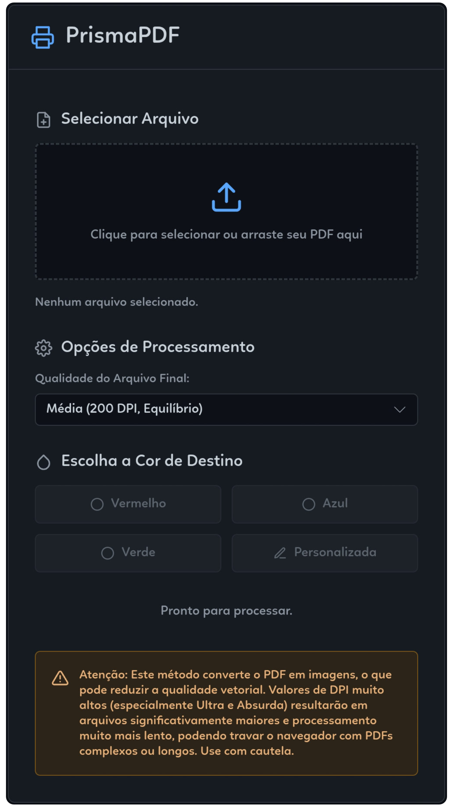

# PrismaPDF 🎨📄

**PrismaPDF** é uma ferramenta web simples e elegante que permite recolorir o conteúdo preto e cinza de arquivos PDF para uma cor de sua escolha. Ideal para situações onde você precisa imprimir um documento, mas está sem tinta preta na impressora, ou simplesmente para dar um novo estilo aos seus PDFs.

O aplicativo converte as páginas do PDF em imagens, aplica a transformação de cor e, em seguida, gera um novo PDF com o conteúdo recolorido.

[Link para o PrismaPDF](https://suntzar.github.io/prismapdf/)



## ✨ Funcionalidades

*   **Interface Intuitiva:** Design moderno e amigável inspirado no tema dark do GitHub.
*   **Seleção de Cores Predefinidas:** Escolha rapidamente entre Vermelho, Azul ou Verde.
*   **Cor Personalizada:** Defina qualquer cor de destino usando valores RGB.
*   **Múltiplas Opções de Qualidade:**
    *   **Baixa (100 DPI):** Para processamento rápido e arquivos menores.
    *   **Média (200 DPI):** Um bom equilíbrio entre qualidade e desempenho.
    *   **Alta (300 DPI):** Ideal para impressões de boa qualidade.
    *   **Ultra (450 DPI):** Para detalhes finos e qualidade superior.
    *   **Absurda (600 DPI):** Qualidade extrema para arquivamento ou zoom digital, com impacto significativo no desempenho e tamanho do arquivo.
*   **Processamento no Navegador:** Todo o processamento é feito localmente no seu navegador, garantindo a privacidade dos seus arquivos. Nenhum dado é enviado para servidores externos.
*   **Feedback Visual:** Indicadores de status e carregamento durante o processamento.
*   **Ícones Feather:** Interface aprimorada com o uso elegante de Feather Icons.

## ⚠️ Atenção Importante

Este método de recolorização envolve a conversão das páginas do PDF em imagens. Como resultado:

*   **Perda de Qualidade Vetorial:** O texto e as linhas no PDF resultante não serão mais vetoriais. Eles podem parecer pixelizados ao serem ampliados significativamente ou impressos em altíssima resolução.
*   **Desempenho com Qualidades Altas:** Selecionar qualidades "Ultra" ou "Absurda", especialmente para PDFs grandes ou complexos, pode consumir muita memória e poder de processamento, levando a lentidão ou até mesmo travamentos no navegador. Use essas opções com cautela.

Esta ferramenta é uma solução prática para contornar a falta de tinta preta ou para fins estilísticos, mas não substitui editores de PDF profissionais para manipulação de conteúdo vetorial.

## 🛠️ Tecnologias Utilizadas

*   **HTML5**
*   **CSS3** (com Variáveis CSS para temização)
*   **JavaScript (ES6+)**
*   **PDF.js (por Mozilla):** Para ler e renderizar arquivos PDF no navegador.
*   **jsPDF:** Para criar o novo arquivo PDF com as imagens recoloridas.
*   **Feather Icons:** Para os ícones da interface.

## 🚀 Como Usar

1.  Acesse o [PrismaPDF](https://suntzar.github.io/prismapdf/).
2.  **Selecione o Arquivo:** Clique na área de upload ou arraste e solte seu arquivo PDF.
3.  **Escolha a Qualidade:** Selecione a qualidade desejada para o arquivo final no menu suspenso.
4.  **Escolha a Cor:**
    *   Clique em um dos botões de cor predefinidos (Vermelho, Azul, Verde).
    *   Ou clique em "Personalizada" e insira os valores RGB (ex: `255,0,0` para vermelho).
5.  **Aguarde o Processamento:** O status será atualizado conforme cada página é processada. O tempo pode variar dependendo do tamanho do PDF e da qualidade selecionada.
6.  **Baixe o PDF:** Quando o processamento estiver concluído, um link de download aparecerá. Clique nele para baixar seu PDF recolorido.

## 🔧 Como Executar Localmente (Para Desenvolvedores)

Se você deseja executar o projeto localmente:

1.  Clone este repositório:
    ```bash
    git clone https://github.com/seu-usuario/prisma-pdf.git
    ```
2.  Navegue até o diretório do projeto:
    ```bash
    cd prisma-pdf
    ```
3.  Abra o arquivo `index.html` diretamente no seu navegador.
    *   Alternativamente, você pode usar um servidor local simples (como o `Live Server` para VS Code) para evitar possíveis problemas com caminhos de arquivo ou políticas de CORS (embora este projeto, sendo um único arquivo HTML, deva funcionar bem diretamente).

## 🤝 Contribuições

Contribuições são bem-vindas! Se você tem ideias para melhorias, novas funcionalidades ou encontrou algum bug:

1.  Faça um Fork do projeto.
2.  Crie uma nova Branch (`git checkout -b feature/sua-feature`).
3.  Faça commit das suas alterações (`git commit -m 'Adiciona sua-feature'`).
4.  Faça Push para a Branch (`git push origin feature/sua-feature`).
5.  Abra um Pull Request.

Por favor, certifique-se de que seu código segue as convenções de estilo do projeto.

## 📝 Licença

Este projeto é distribuído sob a licença MIT. Veja o arquivo `LICENSE` para mais detalhes. *(Você precisará criar um arquivo LICENSE no seu repositório, geralmente com o texto da licença MIT).*

---

Criado com ❤️ por L7
